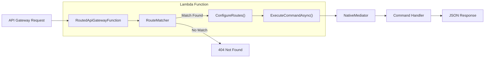

# NativeLambdaRouter

A high-performance API Gateway routing library for AWS Lambda, optimized for **Native AOT**. Provides declarative route mapping to mediator commands with path parameter extraction, health checks, and automatic error handling.

[](https://www.nuget.org/packages/NativeLambdaRouter/)
[](https://github.com/swepay/native-lambda-router/actions/workflows/dotnet.yml)

## Features

- 🚀 **Native AOT Compatible** - Full support for .NET Native AOT compilation
- 🛣️ **Declarative Routing** - Map HTTP endpoints to mediator commands with fluent API
- 📦 **Path Parameters** - Extract parameters from URLs like `/items/{id}`
- ❤️ **Health Checks** - Built-in `/health` and `/healthz` endpoints
- ⚠️ **Error Handling** - Automatic HTTP status codes for common exceptions
- 🔐 **Authorization** - Fluent authorization with policies, roles, and claims
- 🎫 **JWT Claims** - Access authenticated user claims from route context
- 🎯 **NativeMediator Integration** - Seamless integration with CQRS pattern

## Installation

```bash
dotnet add package NativeLambdaRouter
```

## Quick Start

### 1. Create your Lambda Function

```csharp
using System.Text.Json;
using System.Text.Json.Serialization;
using NativeLambdaRouter;
using NativeMediator;

public class Function : RoutedApiGatewayFunction
{
    public Function(IMediator mediator)
        : base(mediator)
    {
    }

    protected override void ConfigureRoutes(IRouteBuilder routes)
    {
        // GET /items - List all items
        routes.MapGet<GetItemsCommand, GetItemsResponse>(
            "/items",
            ctx => new GetItemsCommand());

        // GET /items/{id} - Get item by ID
        routes.MapGet<GetItemByIdCommand, GetItemByIdResponse>(
            "/items/{id}",
            ctx => new GetItemByIdCommand(ctx.PathParameters["id"]));

        // POST /items - Create new item
        routes.MapPost<CreateItemCommand, CreateItemResponse>(
            "/items",
            ctx => JsonSerializer.Deserialize(ctx.Body!, AppJsonContext.Default.CreateItemCommand)!);

        // PUT /items/{id} - Update item
        routes.MapPut<UpdateItemCommand, UpdateItemResponse>(
            "/items/{id}",
            ctx => new UpdateItemCommand(
                ctx.PathParameters["id"],
                JsonSerializer.Deserialize(ctx.Body!, AppJsonContext.Default.UpdateItemRequest)!));

        // DELETE /items/{id} - Delete item
        routes.MapDelete<DeleteItemCommand, DeleteItemResponse>(
            "/items/{id}",
            ctx => new DeleteItemCommand(ctx.PathParameters["id"]));
    }

    protected override async Task<object> ExecuteCommandAsync(
        RouteMatch match,
        RouteContext context,
        IMediator mediator)
    {
        var command = match.Route.CommandFactory(context);

        return command switch
        {
            GetItemsCommand cmd => await mediator.Send(cmd),
            GetItemByIdCommand cmd => await mediator.Send(cmd),
            CreateItemCommand cmd => await mediator.Send(cmd),
            UpdateItemCommand cmd => await mediator.Send(cmd),
            DeleteItemCommand cmd => await mediator.Send(cmd),
            _ => throw new InvalidOperationException($"Unknown command: {command.GetType().Name}")
        };
    }

    // Required for Native AOT - serialize all response types
    protected override string SerializeResponse(object response)
    {
        return response switch
        {
            GetItemsResponse r => JsonSerializer.Serialize(r, AppJsonContext.Default.GetItemsResponse),
            GetItemByIdResponse r => JsonSerializer.Serialize(r, AppJsonContext.Default.GetItemByIdResponse),
            CreateItemResponse r => JsonSerializer.Serialize(r, AppJsonContext.Default.CreateItemResponse),
            UpdateItemResponse r => JsonSerializer.Serialize(r, AppJsonContext.Default.UpdateItemResponse),
            DeleteItemResponse r => JsonSerializer.Serialize(r, AppJsonContext.Default.DeleteItemResponse),
            // Router internal types
            ErrorResponse r => JsonSerializer.Serialize(r, RouterJsonContext.Default.ErrorResponse),
            HealthCheckResponse r => JsonSerializer.Serialize(r, RouterJsonContext.Default.HealthCheckResponse),
            RouteNotFoundResponse r => JsonSerializer.Serialize(r, RouterJsonContext.Default.RouteNotFoundResponse),
            _ => throw new NotSupportedException($"No serializer for {response.GetType().Name}")
        };
    }
}

// Source-generated JSON context for AOT compatibility
[JsonSerializable(typeof(GetItemsCommand))]
[JsonSerializable(typeof(GetItemsResponse))]
[JsonSerializable(typeof(GetItemByIdCommand))]
[JsonSerializable(typeof(GetItemByIdResponse))]
[JsonSerializable(typeof(CreateItemCommand))]
[JsonSerializable(typeof(CreateItemResponse))]
[JsonSerializable(typeof(UpdateItemCommand))]
[JsonSerializable(typeof(UpdateItemRequest))]
[JsonSerializable(typeof(UpdateItemResponse))]
[JsonSerializable(typeof(DeleteItemCommand))]
[JsonSerializable(typeof(DeleteItemResponse))]
[JsonSourceGenerationOptions(PropertyNamingPolicy = JsonKnownNamingPolicy.CamelCase)]
public partial class AppJsonContext : JsonSerializerContext { }
```

## Architecture



## Route Context

The `RouteContext` provides access to request information:

| Property | Type | Description |
|----------|------|-------------|
| `Body` | `string?` | Raw request body |
| `PathParameters` | `Dictionary<string, string>` | URL path parameters (`{id}` → `"123"`) |
| `QueryParameters` | `Dictionary<string, string>` | Query string parameters |
| `Headers` | `Dictionary<string, string>` | Request headers |
| `Claims` | `Dictionary<string, string>` | JWT claims (when authenticated) |

## Dependency Injection

### Singleton Mediator

Use this constructor when `IMediator` is registered as Singleton:

```csharp
public class Function : RoutedApiGatewayFunction
{
    public Function(IMediator mediator)
        : base(mediator)
    {
    }
}
```

### Scoped Mediator

Use this constructor when `IMediator` is registered as Scoped (recommended for database contexts):

```csharp
public class Function : RoutedApiGatewayFunction
{
    public Function(IServiceProvider serviceProvider)
        : base(serviceProvider)
    {
    }
}
```

The mediator is automatically resolved within a scope for each request and passed to `ExecuteCommandAsync`.

## HTTP Methods

```csharp
routes.MapGet<TCommand, TResponse>(path, commandFactory);
routes.MapPost<TCommand, TResponse>(path, commandFactory);
routes.MapPut<TCommand, TResponse>(path, commandFactory);
routes.MapDelete<TCommand, TResponse>(path, commandFactory);
routes.MapPatch<TCommand, TResponse>(path, commandFactory);

// Custom method
routes.Map<TCommand, TResponse>(method, path, commandFactory, requiresAuth: true);
```

## Authorization

NativeLambdaRouter provides a fluent authorization API inspired by ASP.NET Core Minimal APIs.

### Defining Policies

Override `ConfigureAuthorization` to define named policies:

```csharp
protected override void ConfigureAuthorization(AuthorizationBuilder auth)
{
    auth.AddPolicy("admin_greetings", policy =>
        policy
            .RequireRole("admin")
            .RequireClaim("scope", "greetings_api"));
    
    auth.AddPolicy("api_access", policy =>
        policy
            .RequireClaim("scope", "api:read", "api:write")
            .RequireAssertion(ctx => ctx.Headers.ContainsKey("X-Api-Key")));
}
```

### Applying Authorization to Routes

Use fluent methods to apply authorization requirements:

```csharp
protected override void ConfigureRoutes(IRouteBuilder routes)
{
    // Require a named policy
    routes.MapPut<UpdateItemCommand, UpdateItemResponse>(
            "/items/{id}",
            ctx => new UpdateItemCommand(
                ctx.PathParameters["id"],
                JsonSerializer.Deserialize<UpdateItemRequest>(ctx.Body!)!))
        .RequireAuthorization("admin_greetings");
    
    // Require specific roles
    routes.MapDelete<DeleteItemCommand, DeleteItemResponse>(
            "/items/{id}",
            ctx => new DeleteItemCommand(ctx.PathParameters["id"]))
        .RequireRole("admin", "superuser");
    
    // Require specific claims
    routes.MapPost<CreateItemCommand, CreateItemResponse>(
            "/items",
            ctx => JsonSerializer.Deserialize<CreateItemCommand>(ctx.Body!)!)
        .RequireClaim("scope", "items:write");
    
    // Allow anonymous access (bypass authorization)
    routes.MapGet<GetPublicDataCommand, GetPublicDataResponse>(
            "/public",
            ctx => new GetPublicDataCommand())
        .AllowAnonymous();
    
    // Combine multiple requirements
    routes.MapPatch<PatchItemCommand, PatchItemResponse>(
            "/items/{id}",
            ctx => new PatchItemCommand(ctx.PathParameters["id"]))
        .RequireAuthorization("api_access")
        .RequireRole("editor")
        .RequireClaim("department", "engineering");
}
```

### Authorization Methods

| Method | Description |
|--------|-------------|
| `.RequireAuthorization(policies...)` | Requires authentication and optionally specific policies |
| `.RequireRole(roles...)` | Requires the user to have at least one of the specified roles |
| `.RequireClaim(type, values...)` | Requires a claim with one of the specified values |
| `.AllowAnonymous()` | Bypasses all authorization checks |

### Policy Builder Methods

| Method | Description |
|--------|-------------|
| `.RequireRole(roles...)` | User must have at least one of these roles |
| `.RequireClaim(type)` | User must have this claim (any value) |
| `.RequireClaim(type, values...)` | User must have this claim with one of these values |
| `.RequireAssertion(func)` | Custom authorization logic via delegate |

### Role Claim Support

The authorization system automatically checks these claim types for roles:
- `role`
- `roles`
- `cognito:groups` (AWS Cognito)
- `groups`

Roles can be in various formats:
- Single value: `"admin"`
- Comma-separated: `"admin,user"`
- JSON array: `["admin","user"]`

## Error Handling

Built-in exception handling with automatic HTTP status codes:

| Exception | HTTP Status | Response |
|-----------|-------------|----------|
| `ValidationException` | 400 Bad Request | `{ "error": "Validation failed", "details": "..." }` |
| `NotFoundException` | 404 Not Found | `{ "error": "Resource not found", "details": "..." }` |
| `UnauthorizedException` | 401 Unauthorized | `{ "error": "Unauthorized", "details": "..." }` |
| `ForbiddenException` | 403 Forbidden | `{ "error": "Forbidden", "details": "..." }` |
| `ConflictException` | 409 Conflict | `{ "error": "Conflict", "details": "..." }` |
| Other exceptions | 500 Internal Server Error | `{ "error": "Internal server error", "details": "..." }` |

### Using Exceptions

```csharp
public class GetItemHandler : IRequestHandler<GetItemCommand, GetItemResponse>
{
    public async ValueTask<GetItemResponse> Handle(GetItemCommand request, CancellationToken ct)
    {
        var item = await _repository.GetByIdAsync(request.Id);
        
        if (item == null)
            throw new NotFoundException($"Item {request.Id} not found");
        
        if (!item.IsValid)
            throw new ValidationException("Item is not valid");
        
        return new GetItemResponse(item);
    }
}
```

## Health Checks

Built-in health check endpoints respond to `/health` and `/healthz`:

```json
{
  "status": "healthy",
  "function": "MyFunction",
  "timestamp": "2026-01-23T10:30:00.000Z",
  "environment": "production"
}
```

Customize the health check response:

```csharp
protected override HealthCheckResponse GetHealthCheckResponse()
{
    return new HealthCheckResponse
    {
        Status = "healthy",
        Function = GetType().Name,
        Timestamp = DateTime.UtcNow.ToString("o"),
        Environment = Environment.GetEnvironmentVariable("ENVIRONMENT") ?? "unknown"
    };
}
```

> **Note:** If you need custom properties in your health check, create your own response type,
> add it to your `JsonSerializerContext`, and handle it in `SerializeResponse`.

## Native AOT Serialization

The `SerializeResponse` method is **abstract** and must be implemented for Native AOT compatibility.
Use source-generated `JsonSerializerContext` for all response types:

```csharp
protected override string SerializeResponse(object response)
{
    return response switch
    {
        // Your application response types
        GetItemsResponse r => JsonSerializer.Serialize(r, AppJsonContext.Default.GetItemsResponse),
        GetItemByIdResponse r => JsonSerializer.Serialize(r, AppJsonContext.Default.GetItemByIdResponse),
        CreateItemResponse r => JsonSerializer.Serialize(r, AppJsonContext.Default.CreateItemResponse),
        
        // Router internal types (always include these)
        ErrorResponse r => JsonSerializer.Serialize(r, RouterJsonContext.Default.ErrorResponse),
        HealthCheckResponse r => JsonSerializer.Serialize(r, RouterJsonContext.Default.HealthCheckResponse),
        RouteNotFoundResponse r => JsonSerializer.Serialize(r, RouterJsonContext.Default.RouteNotFoundResponse),
        
        _ => throw new NotSupportedException($"No serializer for {response.GetType().Name}")
    };
}

// Define your JSON context with all types
[JsonSerializable(typeof(GetItemsResponse))]
[JsonSerializable(typeof(GetItemByIdResponse))]
[JsonSerializable(typeof(CreateItemCommand))]
// ... add all your types
[JsonSourceGenerationOptions(PropertyNamingPolicy = JsonKnownNamingPolicy.CamelCase)]
public partial class AppJsonContext : JsonSerializerContext { }
```

### Router JSON Context

NativeLambdaRouter provides `RouterJsonContext` with pre-configured serialization for:

| Type | Description |
|------|-------------|
| `ErrorResponse` | Standard error responses (400, 401, 403, 404, 409, 500) |
| `HealthCheckResponse` | Health check endpoint response |
| `RouteNotFoundResponse` | 404 route not found response |

## Requirements

- .NET 10.0 or later
- AWS Lambda with `provided.al2023` runtime
- [NativeMediator](https://www.nuget.org/packages/NativeMediator/) for CQRS pattern

## License

MIT License - see [LICENSE](LICENSE) for details.
