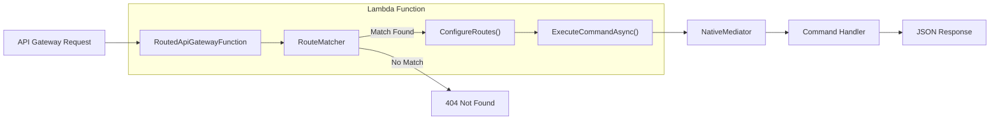

# NativeLambdaRouter

A high-performance API Gateway routing library for AWS Lambda, optimized for **Native AOT**. Provides declarative route mapping to mediator commands with path parameter extraction, health checks, and automatic error handling.

[](https://www.nuget.org/packages/NativeLambdaRouter/)
[](https://github.com/swepay/native-lambda-router/actions/workflows/dotnet.yml)

## Features

- 🚀 **Native AOT Compatible** - Full support for .NET Native AOT compilation
- 🛣️ **Declarative Routing** - Map HTTP endpoints to mediator commands with fluent API
- 📦 **Path Parameters** - Extract parameters from URLs like `/items/{id}`
- ❤️ **Health Checks** - Built-in `/health` and `/healthz` endpoints
- ⚠️ **Error Handling** - Automatic HTTP status codes for common exceptions
- 🔐 **JWT Claims** - Access authenticated user claims from route context
- 🎯 **NativeMediator Integration** - Seamless integration with CQRS pattern

## Installation

```bash
dotnet add package NativeLambdaRouter
```

## Quick Start

### 1. Create your Lambda Function

```csharp
using NativeLambdaRouter;
using NativeMediator;

public class Function : RoutedApiGatewayFunction
{
    public Function(IMediator mediator)
        : base(mediator, JsonSerializerContext.Default.Options)
    {
    }

    protected override void ConfigureRoutes(IRouteBuilder routes)
    {
        // GET /items - List all items
        routes.MapGet<GetItemsCommand, GetItemsResponse>(
            "/items",
            ctx => new GetItemsCommand());

        // GET /items/{id} - Get item by ID
        routes.MapGet<GetItemByIdCommand, GetItemByIdResponse>(
            "/items/{id}",
            ctx => new GetItemByIdCommand(ctx.PathParameters["id"]));

        // POST /items - Create new item
        routes.MapPost<CreateItemCommand, CreateItemResponse>(
            "/items",
            ctx => JsonSerializer.Deserialize<CreateItemCommand>(ctx.Body!)!);

        // PUT /items/{id} - Update item
        routes.MapPut<UpdateItemCommand, UpdateItemResponse>(
            "/items/{id}",
            ctx => new UpdateItemCommand(
                ctx.PathParameters["id"],
                JsonSerializer.Deserialize<UpdateItemRequest>(ctx.Body!)!));

        // DELETE /items/{id} - Delete item
        routes.MapDelete<DeleteItemCommand, DeleteItemResponse>(
            "/items/{id}",
            ctx => new DeleteItemCommand(ctx.PathParameters["id"]));
    }

    protected override async Task<object> ExecuteCommandAsync(
        RouteMatch match,
        RouteContext context)
    {
        var command = match.Route.CommandFactory(context);

        return command switch
        {
            GetItemsCommand cmd => await Mediator.Send(cmd),
            GetItemByIdCommand cmd => await Mediator.Send(cmd),
            CreateItemCommand cmd => await Mediator.Send(cmd),
            UpdateItemCommand cmd => await Mediator.Send(cmd),
            DeleteItemCommand cmd => await Mediator.Send(cmd),
            _ => throw new InvalidOperationException($"Unknown command: {command.GetType().Name}")
        };
    }
}
```

## Architecture



## Route Context

The `RouteContext` provides access to request information:

| Property | Type | Description |
|----------|------|-------------|
| `Body` | `string?` | Raw request body |
| `PathParameters` | `Dictionary<string, string>` | URL path parameters (`{id}` → `"123"`) |
| `QueryParameters` | `Dictionary<string, string>` | Query string parameters |
| `Headers` | `Dictionary<string, string>` | Request headers |
| `Claims` | `Dictionary<string, string>` | JWT claims (when authenticated) |

## HTTP Methods

```csharp
routes.MapGet<TCommand, TResponse>(path, commandFactory);
routes.MapPost<TCommand, TResponse>(path, commandFactory);
routes.MapPut<TCommand, TResponse>(path, commandFactory);
routes.MapDelete<TCommand, TResponse>(path, commandFactory);
routes.MapPatch<TCommand, TResponse>(path, commandFactory);

// Custom method
routes.Map<TCommand, TResponse>(method, path, commandFactory, requiresAuth: true);
```

## Error Handling

Built-in exception handling with automatic HTTP status codes:

| Exception | HTTP Status | Response |
|-----------|-------------|----------|
| `ValidationException` | 400 Bad Request | `{ "error": "Validation failed", "details": "..." }` |
| `NotFoundException` | 404 Not Found | `{ "error": "Resource not found", "details": "..." }` |
| `UnauthorizedException` | 401 Unauthorized | `{ "error": "Unauthorized", "details": "..." }` |
| `ForbiddenException` | 403 Forbidden | `{ "error": "Forbidden", "details": "..." }` |
| `ConflictException` | 409 Conflict | `{ "error": "Conflict", "details": "..." }` |
| Other exceptions | 500 Internal Server Error | `{ "error": "Internal server error", "details": "..." }` |

### Using Exceptions

```csharp
public class GetItemHandler : IRequestHandler<GetItemCommand, GetItemResponse>
{
    public async ValueTask<GetItemResponse> Handle(GetItemCommand request, CancellationToken ct)
    {
        var item = await _repository.GetByIdAsync(request.Id);
        
        if (item == null)
            throw new NotFoundException($"Item {request.Id} not found");
        
        if (!item.IsValid)
            throw new ValidationException("Item is not valid");
        
        return new GetItemResponse(item);
    }
}
```

## Health Checks

Built-in health check endpoints respond to `/health` and `/healthz`:

```json
{
  "status": "healthy",
  "function": "MyFunction",
  "timestamp": "2026-01-23T10:30:00.000Z",
  "environment": "production"
}
```

Customize the health check response:

```csharp
protected override object GetHealthCheckResponse()
{
    return new
    {
        Status = "healthy",
        Version = "1.0.0",
        Dependencies = new { Database = "ok", Cache = "ok" }
    };
}
```

## Native AOT Serialization

For Native AOT compatibility, override `SerializeResponse`:

```csharp
protected override string SerializeResponse(object response)
{
    return response switch
    {
        GetItemsResponse r => JsonSerializer.Serialize(r, JsonSerializerContext.Default.GetItemsResponse),
        GetItemByIdResponse r => JsonSerializer.Serialize(r, JsonSerializerContext.Default.GetItemByIdResponse),
        _ => JsonSerializer.Serialize(response, JsonSerializerContext.Default.Object)
    };
}
```

## Requirements

- .NET 10.0 or later
- AWS Lambda with `provided.al2023` runtime
- [NativeMediator](https://www.nuget.org/packages/NativeMediator/) for CQRS pattern

## License

MIT License - see [LICENSE](LICENSE) for details.
